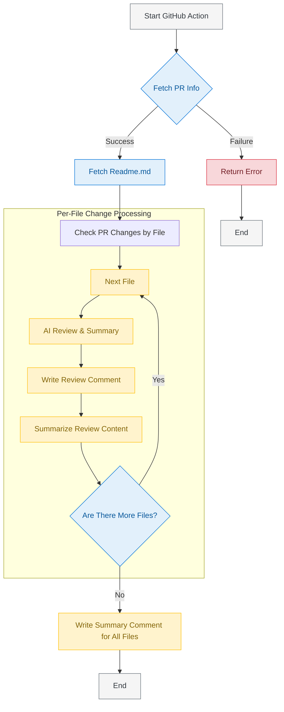
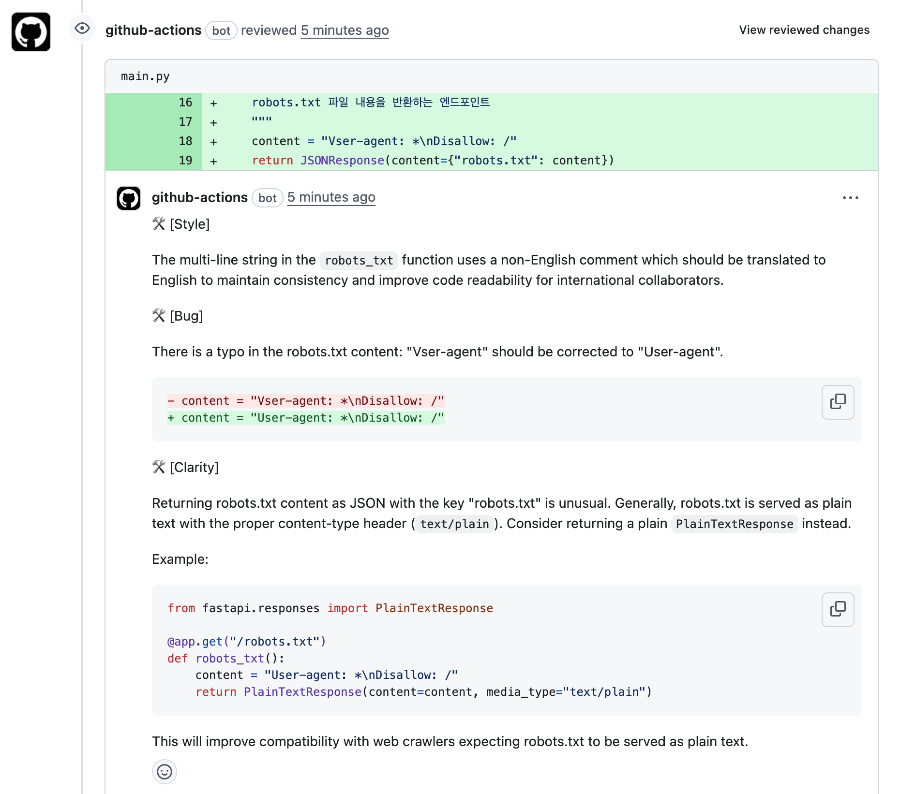
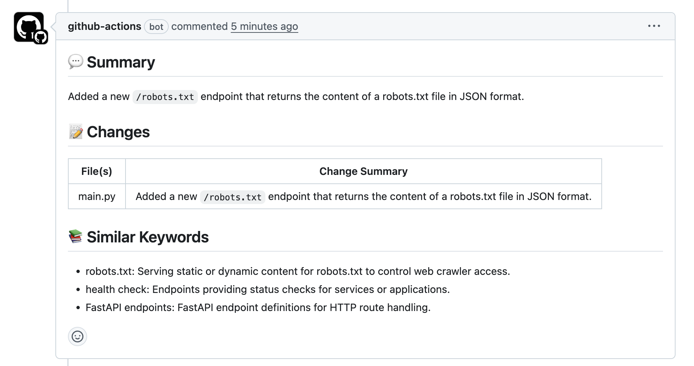

# AI Code Reviewer

[한국어](README.md) | [English](README.en.md)

A simple GitHub Action tool for automated code review of Pull Requests using AI.

## ✨ Key Features

* **Easy Setup**: Automatically generates workflow file with a single command
* **Intuitive Usage**: Just leave a simple comment on your PR to trigger reviews
* **Cost Efficient**: Pay only for what you use (OpenAI/Gemini API)
* **Multilingual Support**: Provides review results in your preferred language (default: Korean)
* **Multiple Models**: Supports various Gemini and OpenAI model options

## 🚀 Getting Started

1. Run the following command at your project root:
   ```bash
   bash <(curl -s https://raw.githubusercontent.com/lee-lou2/ai-code-reviewer/main/create-workflow.sh)
   ```

2. In your GitHub repository, go to `Settings > Secrets and variables > Actions` and add one of the following:
   * `GEMINI_API_KEY`: Gemini API key
   * `OPENAI_API_KEY`: OpenAI API key

3. (Optional) README.md file creation (refer to this document for answers)

## 📝 Usage

After creating a PR, simply comment:

```
/review
```

For specific requirements:

```
/review Please focus on identifying security vulnerabilities
```

## 📊 Project Workflow



## 💡 Example Output

### Per-file Comment



### PR Summary Comment



## 🔧 Configuration Options

You can set the following options in `.github/workflows/ai-code-reviewer.yml`:

| Option | Description | Default |
|--------|-------------|---------|
| `GITHUB_TOKEN` | GitHub token (required) | `${{ secrets.GITHUB_TOKEN }}` |
| `GEMINI_API_KEY` | Gemini API key | - |
| `GEMINI_MODEL` | Gemini model name | `gemini-2.5-flash-preview-04-17` |
| `OPENAI_API_KEY` | OpenAI API key | - |
| `OPENAI_MODEL` | OpenAI model name | `gpt-4o-mini` |
| `MAX_OUTPUT_TOKENS` | Maximum output tokens | `2048` |
| `EXCLUDE` | File patterns to exclude | `*.md,*.txt,package-lock.json,*.yml,*.yaml` |
| `LANGUAGE` | Review language | `English` |

## 📄 License

[MIT License](LICENSE)