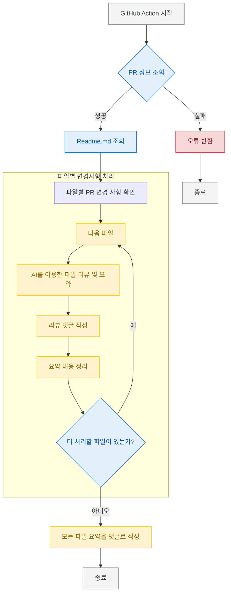
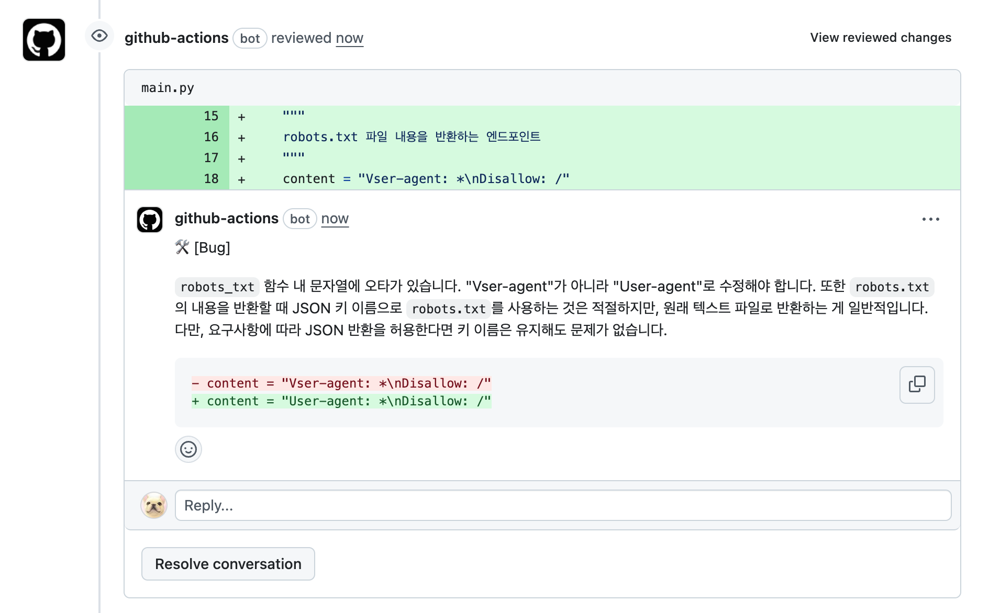
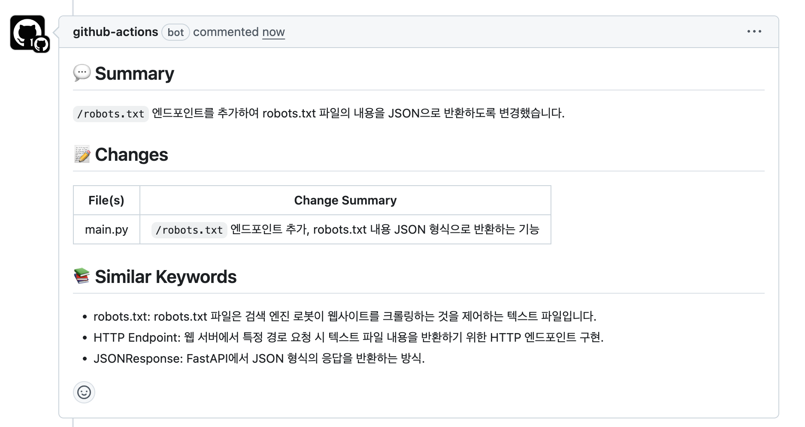

# AI 코드 리뷰어 (AI Code Reviewer)

[한국어](README.md) | [English](README.en.md)

AI를 이용해서 Pull Request 코드 리뷰를 수행하는 간편한 GitHub Action 도구

## ✨ 주요 특징

* **간편한 설정**: 단일 명령어로 워크플로우 파일 자동 생성
* **직관적인 사용법**: PR 댓글에 간단한 커맨드만 입력
* **비용 효율성**: 사용한 만큼만 비용 발생 (OpenAI/Gemini API)
* **다국어 지원**: 원하는 언어로 리뷰 결과 제공 (기본: 한국어)
* **다양한 모델**: Gemini 및 OpenAI의 여러 모델 옵션 제공

## 🚀 적용 방법

1. 프로젝트 루트 경로에서 다음 명령어 실행:
   ```bash
   bash <(curl -s https://raw.githubusercontent.com/lee-lou2/ai-code-reviewer/main/create-workflow.sh)
   ```

2. GitHub 레포지토리의 `Settings > Secrets and variables > Actions`에서 다음 중 하나 추가:
   * `GEMINI_API_KEY`: Gemini API 키
   * `OPENAI_API_KEY`: OpenAI API 키

3. (선택) README.md 파일 작성(해당 내용을 참고하여 답변을 진행)

## 📝 사용 방법

PR 생성 후 댓글에 다음과 같이 입력:

```
/review
```

특정 요구사항이 있는 경우:

```
/review 보안 관련 취약점을 중점적으로 검토해주세요
```

## 📊 프로젝트 흐름



## 💡 결과 예시

### 파일별 코멘트



### PR 요약 코멘트



## 🔧 설정 옵션

`.github/workflows/ai-code-reviewer.yml` 파일에서 다음 옵션 설정 가능:

| 옵션 | 설명 | 기본값 |
|------|------|--------|
| `GITHUB_TOKEN` | GitHub 토큰 (필수) | `${{ secrets.GITHUB_TOKEN }}` |
| `GEMINI_API_KEY` | Gemini API 키 | - |
| `GEMINI_MODEL` | Gemini 모델명 | `gemini-2.5-flash-preview-04-17` |
| `OPENAI_API_KEY` | OpenAI API 키 | - |
| `OPENAI_MODEL` | OpenAI 모델명 | `gpt-4o-mini` |
| `MAX_OUTPUT_TOKENS` | 최대 출력 토큰 수 | `2048` |
| `EXCLUDE` | 제외할 파일 패턴 | `*.md,*.txt,package-lock.json,*.yml,*.yaml` |
| `LANGUAGE` | 리뷰 언어 | `Korean` |

## 📄 라이선스

[MIT License](LICENSE)